# FinWiz: Get the Wall Street Edge


FinWiz is an advanced financial data extraction tool that leverages AI to analyze 10-K filings from major companies, providing investors with quick access to essential financial metrics and insights.

## 🚀 Problem Statement

Financial analysis is traditionally:
- **Expensive**: Existing tools cost $15,000+ per user annually
- **Time-consuming**: Manual document reviews take 4+ hours per document
- **Complex**: Financial data is buried in lengthy documents with inconsistent formatting

## 💡 Solution

FinWiz democratizes financial data extraction by providing:
- **Intelligent retrieval**: Company-specific financial data extraction from complex documents
- **Automated analysis**: Rapid extraction of key metrics needed for DCF analysis
- **Accessible insights**: Intuitive interface for both retail and institutional investors

## ✨ Features

FinWiz offers three core modules:

### 1. FinChat
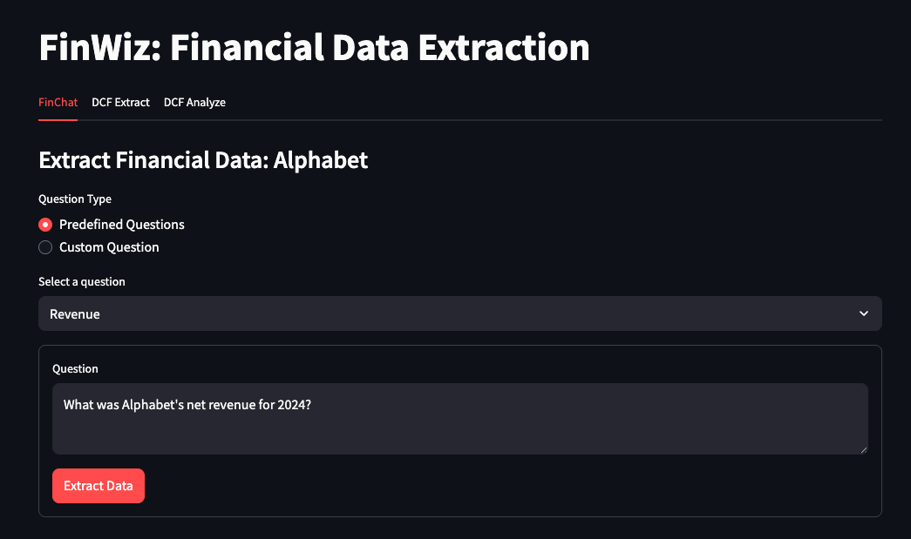
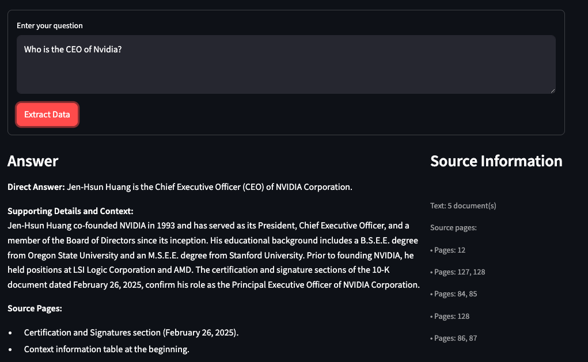
- Query 10-K documents using natural language
- Choose from built-in queries or create custom questions
- Get direct answers with source page references
- View context and supporting information from the document

### 2. DCF Extract
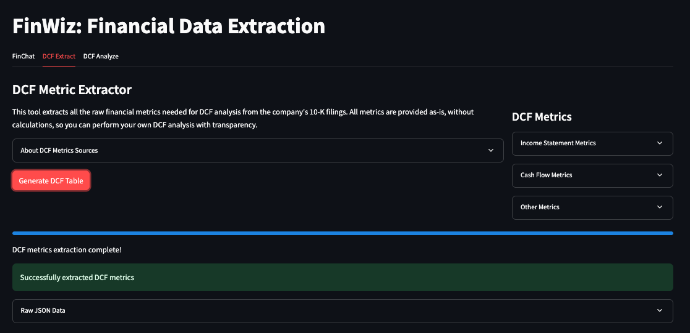
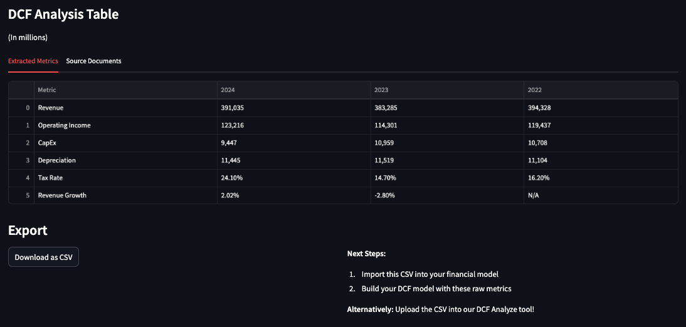
- Automatically extract core financial metrics needed for DCF analysis
- Company-specific retrieval strategies for accurate data extraction
- Support for key metrics including Revenue, Operating Income, Tax Rate, CapEx, and Depreciation
- Export data as CSV for further analysis

### 3. DCF Analyze
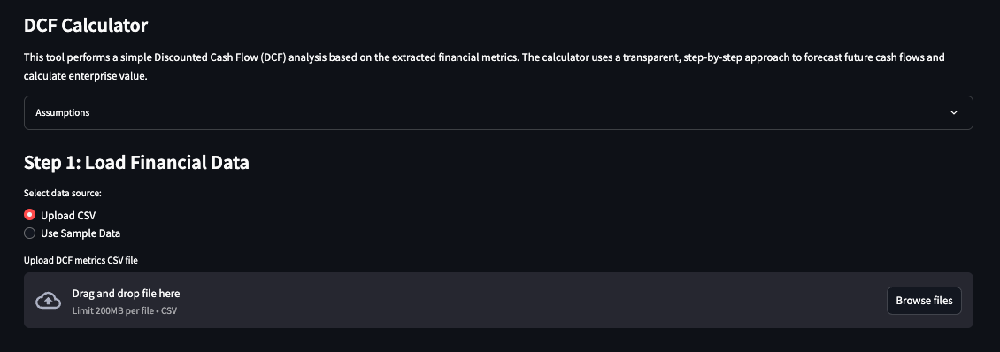
- Perform discounted cash flow analysis with extracted metrics
- Generate visual reports and insights dashboards
- Transparency in all calculation steps

## 🔧 Technology Stack

FinWiz leverages a comprehensive AI stack:

- **Frontend**: Streamlit
- **Content Extraction**: Mistral AI
- **Embeddings**: Cohere embed-v4.0
- **Vector Database**: Pinecone
- **Generation Models**: 
  - GPT-4o via Azure OpenAI
  - Qwen3-14B via Ollama locally
- **Image Storage**: Google Cloud Storage

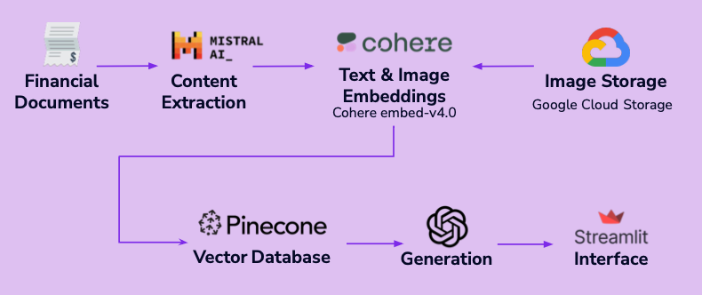

## 🏗️ Architecture

```
Financial Documents → Content Extraction → Text & Image Embeddings → Vector Database → Generation Models → Streamlit Interface
```

Key innovations:
- Multi-query, multi-approach retrieval for financial metrics
- Company-specific retrieval strategies
- Sophisticated content detection for financial tables
- Table structure parsing and analysis

## 🔍 Retrieval System Under the Hood

The DCF Extract tool utilizes a sophisticated retrieval system to accurately extract financial metrics:

1. **Vector Database**: Uses Pinecone with Cohere embeddings to store chunked 10-K documents
2. **Company-Specific Strategies**: Custom retrieval patterns for each company's unique 10-K formatting
3. **Multi-Query Approach**: Employs multiple specialized queries per financial metric to maximize recall
4. **Content Classification**: Identifies financial tables, income statements, and specific metrics through pattern matching
5. **Specialized Extraction**: Uses targeted approaches for challenging metrics (CapEx, Depreciation)

## 📋 Installation

```bash
# Clone the repository
git clone https://github.com/Henry-Hu-25/financial_wizard.git
cd financial_wizard

# Create environment
conda env create -f environment.yml

# Set up environment variables (.env file)
# PINECONE_API_KEY=your_pinecone_key
# PINECONE_ENVIRONMENT=your_pinecone_env
# INDEX_NAME=your_index_name
# COHERE_API_KEY=your_cohere_key
# AZURE_API_KEY=your_azure_key (optional)

# Run the application
streamlit run dcf_app.py
```

## 🖼️ Screenshots

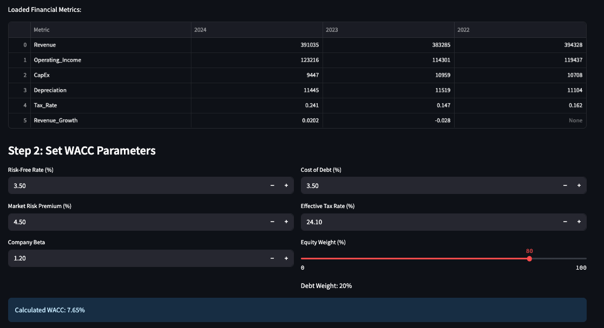
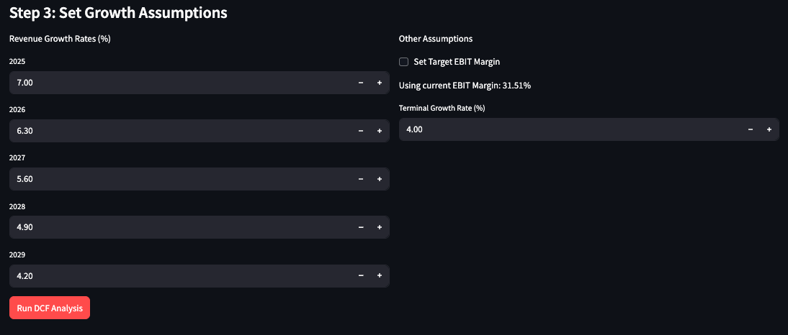
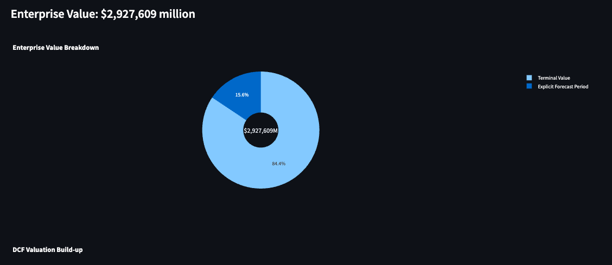
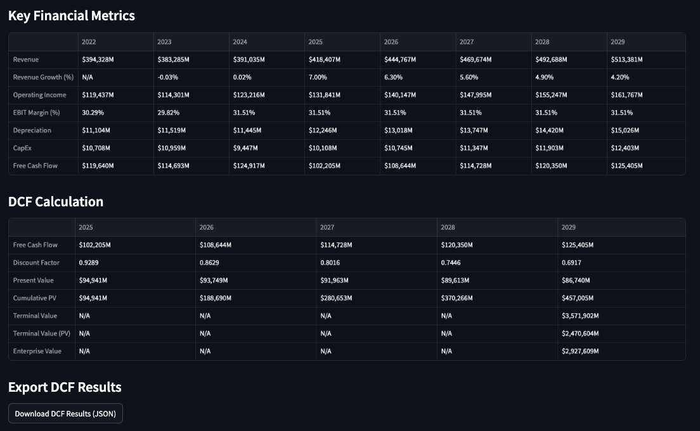

## 🛑 Limitations & Challenges

Current limitations:
- LLM reasoning capacity with financial tables
- PDF format complexity and table recognition
- Company-specific retrieval strategies lack generalizability
- Limited to companies with processed 10-K documents (currently Mag 7)

## 🔮 Future Development

- Expand coverage to more companies
- Real-time market data integration
- Automate pipeline for continuous updates
- Implement computer vision for improved financial document processing
- Develop a more polished React/Vercel frontend

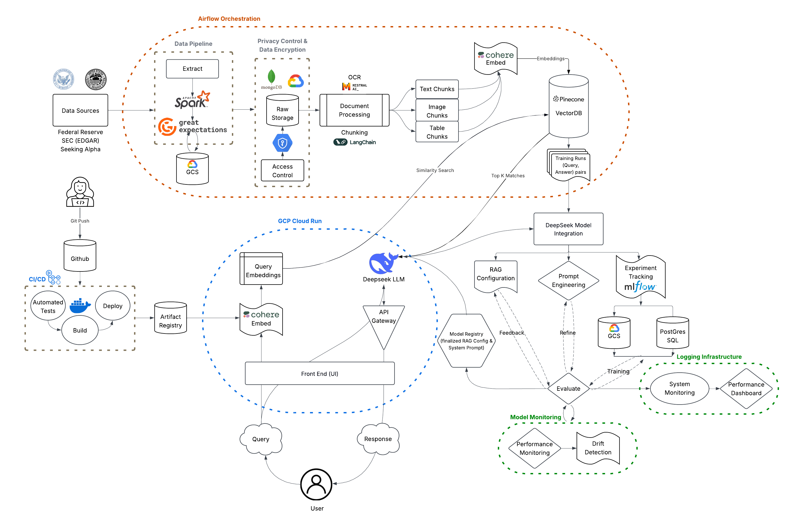

## 👥 Team

FinWiz was developed by Team Wrapper:
- Cheryl Lee
- Henry Hu
- Victor Wei
- Zoe Zhuang
- Katelyn Vuong
